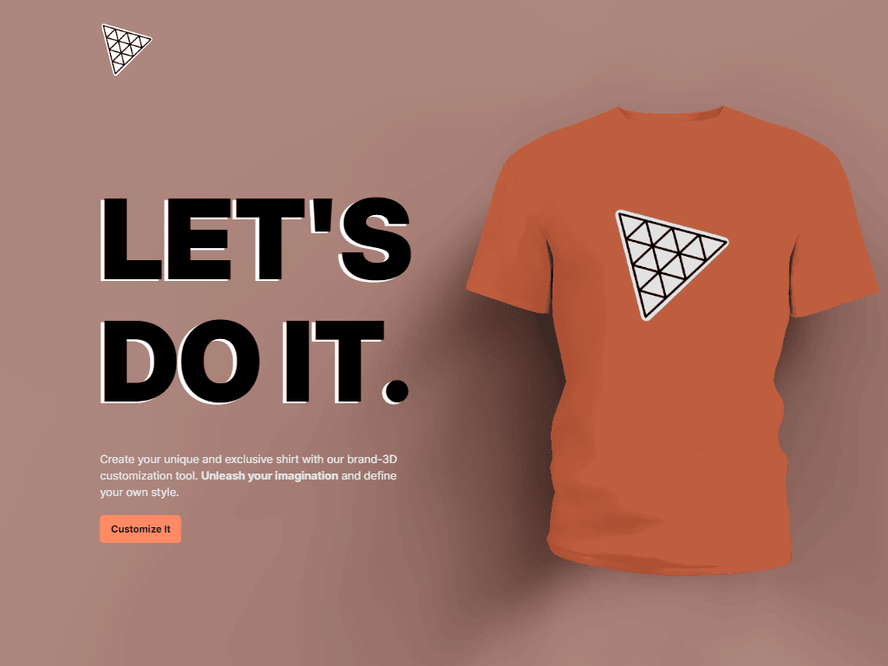
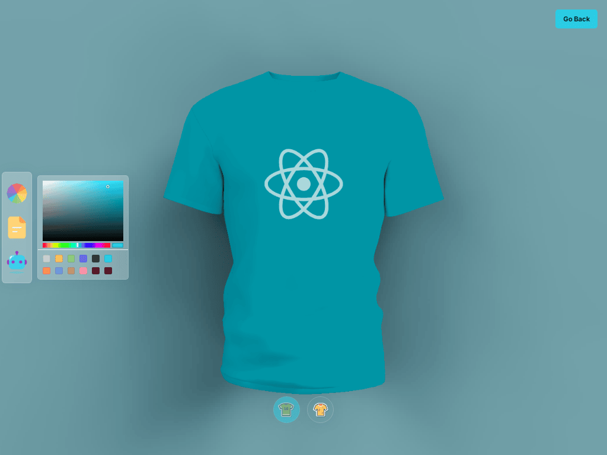
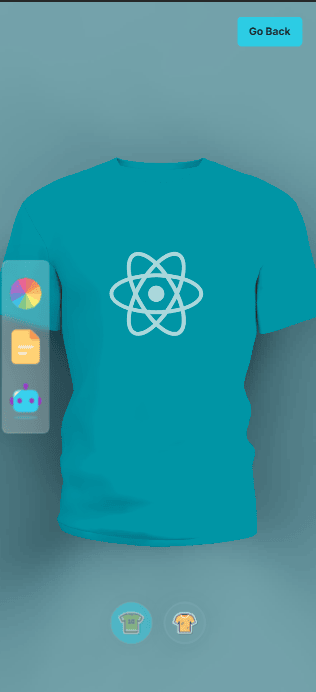

# 📱 3D Product website

### Many large corporations already use 3D graphics to showcase their products. this is what I've created with threeJs. You can change the color of the shirt with a color picker, you can even upload an image and use it for texture or full texture. this is my first project with threeJs and react-three-fiber, i hope you like it !

## Link 🔗 [https://charactermi.github.io/customizable-shirt](https://charactermi.github.io/customizable-shirt)

 

# Preview

 

# Mobile Responsive

# Technologies

 

<ul>
    <li>
        
    </li>
    <li>
        
    </li>
    <li>
        
    </li>
    <li>
        
    </li>
    <li>  
        
    </li>
    <li>
        
    </li>
</ul>
